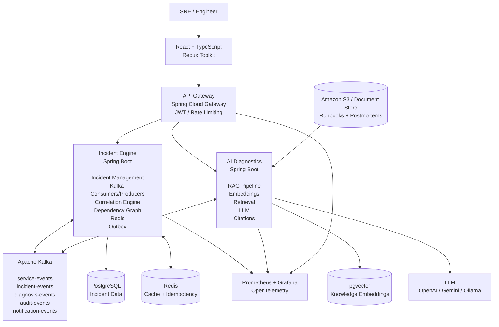
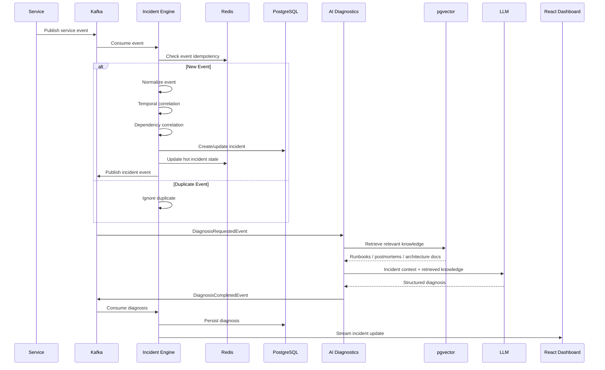

# Automated Incident Triage Platform

An event-driven reliability platform that automatically correlates real-time microservice failures into unified incidents and uses Retrieval-Augmented Generation (RAG) to diagnose probable root causes and recommend remediation steps using internal engineering knowledge.

The platform is designed as an automated **Level-1 SRE assistant**: it consumes service events through Kafka, detects correlated failures across dependent services, maintains incident state, and enriches incidents with AI-generated diagnosis backed by runbooks, postmortems, and architecture documentation.

---

## Overview

In distributed microservice architectures, a single infrastructure or application failure can generate hundreds of downstream alerts.

For example:

```text
PostgreSQL connection failure
        ↓
Payment Service
        ↓
Order Service
        ↓
Checkout Service
        ↓
Dozens of alerts
```

Traditional alerting systems can report every symptom independently, forcing engineers to manually determine which alerts belong to the same underlying failure.

The Automated Incident Triage Platform addresses this by:

1. Ingesting service errors and operational events through Kafka.
2. Deduplicating and correlating related events.
3. Using service dependencies and temporal relationships to identify cascading failures.
4. Creating a unified incident with severity and affected-service information.
5. Maintaining hot incident state using Redis.
6. Triggering an AI diagnosis workflow.
7. Retrieving relevant runbooks, postmortems, and architecture documentation using pgvector.
8. Combining retrieved knowledge with live incident context.
9. Generating a structured root-cause analysis with evidence, confidence, citations, and recommended remediation.
10. Streaming incident updates to the React dashboard in real time.

---

# Core Features

### Event-Driven Incident Processing

* Kafka-based service event ingestion
* Idempotent event processing
* Consumer groups
* Partitioning by service/incident
* Retry handling
* Dead-letter queues
* Event schema versioning
* Correlation IDs and event IDs

### Automated Alert Correlation

Correlates service failures using multiple signals:

* Temporal proximity
* Service identity
* Error patterns
* Shared dependencies
* Failure propagation
* Incident severity
* Existing active incidents

Instead of creating separate incidents for every downstream symptom, the platform attempts to identify the underlying failure and group related alerts into a single incident.

### Dependency-Aware Incident Analysis

Maintains relationships between services to identify cascading failures.

Example:

```text
checkout-service
       ↓
order-service
       ↓
payment-service
       ↓
postgresql
```

If the payment service begins failing, the platform can identify downstream services that are likely experiencing secondary failures.

### AI-Assisted Root Cause Analysis

The AI diagnostics service combines:

* Current incident information
* Recent service events
* Affected services
* Dependency information
* Historical incidents
* Relevant engineering documentation

with retrieved knowledge from the RAG pipeline.

The generated diagnosis contains:

* Probable root cause
* Confidence score
* Supporting evidence
* Contributing factors
* Recommended remediation
* Source citations

### Context-Aware RAG

The platform does not blindly embed every production log.

Instead, relatively stable engineering knowledge is indexed:

* Runbooks
* Postmortems
* Architecture documentation
* Troubleshooting guides
* Deployment documentation

Live incident events are supplied as runtime context to the AI diagnosis pipeline.

```text
Engineering Documents
        ↓
Document Processing
        ↓
Chunking
        ↓
Embeddings
        ↓
pgvector
        ↓
Semantic Retrieval
        ↓
Relevant Knowledge
        ↓
        ┌─────────────────────┐
        │ Current Incident   │
        │ + Live Events      │
        │ + Dependencies     │
        │ + Retrieved Docs   │
        └─────────┬───────────┘
                  ↓
                 LLM
                  ↓
        Structured Diagnosis
```

### Redis-Based Reliability

Redis is used for:

* Hot incident-state caching
* Service health caching
* Idempotency tracking
* Distributed coordination/locks
* API rate limiting where appropriate

### Transactional Consistency

The incident engine uses transactional patterns such as the **Transactional Outbox** where database state changes must reliably produce Kafka events.

This prevents failures such as:

```text
Database updated
       ↓
Kafka publish fails
       ↓
System state becomes inconsistent
```

Instead:

```text
Database Transaction
       │
       ├── Incident update
       │
       └── Outbox event
               ↓
        Outbox Publisher
               ↓
             Kafka
```

### Real-Time Dashboard

The React frontend provides:

* Active incident dashboard
* Incident filtering and search
* Incident details
* Incident timeline
* Service health
* Dependency visualization
* Event stream
* AI diagnosis
* Recommended remediation
* Knowledge-base management

Live incident updates are delivered using Server-Sent Events (SSE).

---

# Architecture

The platform is organized as a monorepo containing a React frontend and three independently deployable backend services.

```text
automated-incident-triage/
│
├── frontend/
│   └── React + TypeScript + Redux Toolkit
│
├── backend/
│   │
│   ├── api-gateway/
│   │   └── Edge routing, JWT validation, rate limiting
│   │
│   ├── incident-engine/
│   │   └── Incident domain, Kafka, correlation, dependencies,
│   │       Redis, persistence and reliability workflows
│   │
│   └── ai-diagnostics/
│       └── RAG ingestion, embeddings, pgvector,
│           retrieval and LLM diagnosis
│
├── infrastructure/
│   ├── docker/
│   ├── kafka/
│   ├── kubernetes/
│   └── terraform/
│
├── docs/
│   ├── architecture/
│   ├── api/
│   ├── events/
│   └── decisions/
│
└── docker-compose.yml
```

## High-Level Architecture



---

# Incident Processing Flow

The main production workflow is:



---

# Microservices

## 1. API Gateway

**Technology:** Spring Cloud Gateway, Spring Security

Responsibilities:

* Single entry point for the frontend
* JWT authentication
* Request authorization
* Routing
* Rate limiting
* Request filtering
* Internal-service protection
* SSE proxying

The frontend does not directly access the internal services.

```text
React
  ↓
API Gateway
  ↓
Internal Services
```

---

## 2. Incident Engine

**Technology:** Java 21, Spring Boot 3, Spring Kafka, PostgreSQL, Redis

The Incident Engine is the core of the platform.

Responsibilities:

* Incident lifecycle management
* Service registry
* Service dependency management
* Kafka event ingestion
* Event normalization
* Deduplication
* Alert correlation
* Incident severity calculation
* Dependency-aware analysis
* Incident persistence
* Redis caching
* Idempotency
* Transactional Outbox
* Retry/DLQ handling
* Audit events
* Diagnosis workflow orchestration
* Real-time incident updates

### Core domain

```text
Service
ServiceDependency
Incident
IncidentEvent
IncidentTimeline
Diagnosis
AuditEvent
```

### Incident lifecycle

```text
OPEN
  ↓
ACKNOWLEDGED
  ↓
INVESTIGATING
  ↓
MITIGATED
  ↓
RESOLVED
```

---

## 3. AI Diagnostics

**Technology:** Spring AI / LangChain4j, pgvector, OpenAI/Gemini/Ollama

Responsibilities:

* Knowledge ingestion
* Document parsing
* Chunking
* Embedding generation
* Vector storage
* Semantic retrieval
* Incident-context construction
* LLM prompting
* Structured diagnosis
* Evidence extraction
* Source citations
* Remediation recommendations

The service is triggered asynchronously through Kafka when an incident requires diagnosis.

---

# Event-Driven Architecture

Kafka acts as the asynchronous backbone of the platform.

### Core Topics

```text
service-events
incident-events
correlation-events
diagnosis-events
notification-events
audit-events
```

### Example service event

```json
{
  "eventId": "evt-123",
  "eventType": "SERVICE_ERROR",
  "schemaVersion": 1,
  "correlationId": "corr-456",
  "timestamp": "2026-08-19T08:30:00Z",
  "serviceId": "payment-service",
  "severity": "HIGH",
  "message": "PostgreSQL connection pool exhausted",
  "instanceId": "payment-03"
}
```

### Kafka reliability mechanisms

* Idempotent producers
* Consumer groups
* Partitioning by service/incident
* Retry topics
* Dead-letter topics
* Offset management
* Event IDs
* Correlation IDs
* Schema versioning
* Transactional Outbox

---

# Alert Correlation

The correlation engine combines multiple signals instead of relying on a single rule.

```text
Incoming Events
      ↓
Normalization
      ↓
Deduplication
      ↓
Temporal Correlation
      ↓
Service Correlation
      ↓
Dependency Graph Analysis
      ↓
Existing Incident Matching
      ↓
Severity Calculation
      ↓
Create / Update Incident
```

### Example

Suppose the following events arrive:

```text
10:01 payment-service → PostgreSQL timeout
10:02 payment-service → Connection refused
10:02 order-service → Payment API timeout
10:03 checkout-service → Payment API timeout
```

The dependency graph:

```text
checkout-service
       ↓
order-service
       ↓
payment-service
       ↓
postgresql
```

allows the platform to recognize that the downstream failures may be symptoms of the same underlying payment/database failure.

Instead of creating four independent incidents, the system attempts to produce:

```text
INC-1024
P1 — Payment Service Outage

Root service:
payment-service

Affected:
payment-service
order-service
checkout-service
```

---

# RAG Pipeline

The RAG pipeline indexes relatively stable engineering knowledge.

```text
Runbooks
Postmortems
Architecture Docs
Troubleshooting Guides
Deployment Docs
        ↓
Document Ingestion
        ↓
Text Extraction
        ↓
Chunking
        ↓
Metadata Enrichment
        ↓
Embedding Generation
        ↓
pgvector
```

At diagnosis time:

```text
Current Incident
      +
Recent Events
      +
Affected Services
      +
Dependency Graph
      +
Retrieved Knowledge
      ↓
      LLM
      ↓
Root Cause Analysis
      +
Evidence
      +
Confidence
      +
Recommended Actions
      +
Citations
```

---

# AI Diagnosis Output

The AI service returns a structured diagnosis rather than an unstructured chatbot response.

Example:

```json
{
  "incidentId": 1024,
  "probableCause": "PostgreSQL connection pool exhaustion",
  "confidence": 0.91,
  "evidence": [
    "High frequency of database connection timeout events",
    "Payment service error rate increased immediately after connection saturation",
    "A similar historical incident was resolved by increasing pool capacity"
  ],
  "contributingFactors": [
    "Increased payment traffic",
    "Connection pool configuration"
  ],
  "recommendedActions": [
    "Inspect PostgreSQL connection utilization",
    "Check payment service connection pool configuration",
    "Compare deployment configuration with the previous release"
  ],
  "citations": [
    {
      "document": "database-connection-pool-runbook",
      "section": "Connection Exhaustion"
    },
    {
      "document": "incident-843-postmortem",
      "section": "Root Cause"
    }
  ]
}
```

---

# Data Storage

## PostgreSQL

Primary relational store for:

* Incidents
* Services
* Dependencies
* Incident events
* Incident timelines
* AI diagnoses
* Audit records
* Outbox events

## pgvector

PostgreSQL vector extension used for:

* Runbook embeddings
* Postmortem embeddings
* Architecture documentation embeddings
* Semantic similarity search

## Redis

Used for:

* Hot incident state
* Service health cache
* Idempotency keys
* Distributed coordination
* Rate limiting state

## Object Storage

S3 is used in the AWS deployment for:

* Runbooks
* Postmortems
* Architecture documents
* Large archived event/log data

---

# Security

The platform uses Spring Security and JWT-based authentication.

### Roles

```text
ADMIN
SRE
VIEWER
```

### Example permissions

```text
VIEWER
  → View incidents

SRE
  → View incidents
  → Acknowledge
  → Investigate
  → Mitigate
  → Resolve

ADMIN
  → All SRE permissions
  → Manage services
  → Manage dependencies
  → Manage knowledge base
```

Additional security controls include:

* JWT validation at the API Gateway
* Internal services isolated from public access
* Input validation
* Parameterized database queries
* Secret management
* TLS in production
* AWS IAM roles
* Least-privilege permissions

---

# Observability

Because this platform is itself a reliability system, its own services are instrumented for observability.

### Metrics

Using Micrometer and Prometheus:

```text
HTTP request latency
Kafka throughput
Kafka consumer lag
Event processing failures
Incident correlation latency
Redis hit ratio
Database latency
RAG retrieval latency
LLM latency
AI diagnosis success rate
```

### Distributed tracing

OpenTelemetry provides tracing across:

```text
React
  ↓
API Gateway
  ↓
Incident Engine
  ↓
Kafka
  ↓
AI Diagnostics
  ↓
LLM / pgvector
```

### Dashboards

Grafana dashboards provide visibility into:

* Service health
* Kafka consumer lag
* Incident creation rate
* Event processing latency
* AI diagnosis latency
* Infrastructure health

---

# Local Development

## Prerequisites

* Java 21+
* Maven
* Node.js 18+
* Docker
* Docker Compose
* OpenAI/Gemini API key or local Ollama installation

---

## Start Infrastructure

```bash
docker compose up -d
```

Local infrastructure:

```text
Kafka
PostgreSQL + pgvector
Redis
```

Kafka runs using KRaft mode, so ZooKeeper is not required.

---

## Environment Variables

Example:

```bash
OPENAI_API_KEY=your-api-key
SPRING_DATASOURCE_URL=jdbc:postgresql://localhost:5432/incident_db
SPRING_DATASOURCE_USERNAME=postgres
SPRING_DATASOURCE_PASSWORD=postgres
REDIS_HOST=localhost
REDIS_PORT=6379
KAFKA_BOOTSTRAP_SERVERS=localhost:9092
```

Never commit API keys or production credentials to the repository.

---

# Running the Backend

From the backend directory:

```bash
cd backend

mvn clean install
```

Run each service:

```bash
mvn spring-boot:run -pl api-gateway
```

```bash
mvn spring-boot:run -pl incident-engine
```

```bash
mvn spring-boot:run -pl ai-diagnostics
```

---

# Running the Frontend

```bash
cd frontend

npm install
npm run dev
```

The frontend communicates with the backend through the API Gateway.

---

# Infrastructure & Deployment

The application is designed to run locally using Docker Compose and in AWS using Kubernetes.

### Local

```text
Docker Compose
│
├── Kafka
├── PostgreSQL
└── Redis
```

### AWS

```text
AWS
│
├── VPC
├── EKS
│   ├── API Gateway
│   ├── Incident Engine
│   └── AI Diagnostics
│
├── Amazon MSK
├── Amazon RDS PostgreSQL
├── ElastiCache Redis
├── S3
├── ECR
└── CloudWatch
```

Infrastructure is provisioned using Terraform.

---

# CI/CD

The deployment pipeline follows:

```text
Git Push
   ↓
GitHub Actions
   ↓
Unit Tests
   ↓
Integration Tests
   ↓
Build
   ↓
Docker Image
   ↓
Amazon ECR
   ↓
Helm Deployment
   ↓
Amazon EKS
```

---

# Infrastructure Repository Structure

```text
infrastructure/
│
├── terraform/
│   ├── main.tf
│   ├── variables.tf
│   ├── outputs.tf
│   ├── vpc.tf
│   ├── eks.tf
│   ├── rds.tf
│   ├── redis.tf
│   ├── msk.tf
│   ├── s3.tf
│   └── iam.tf
│
├── kubernetes/
│   ├── api-gateway/
│   ├── incident-engine/
│   └── ai-diagnostics/
│
└── docker/
```

---


